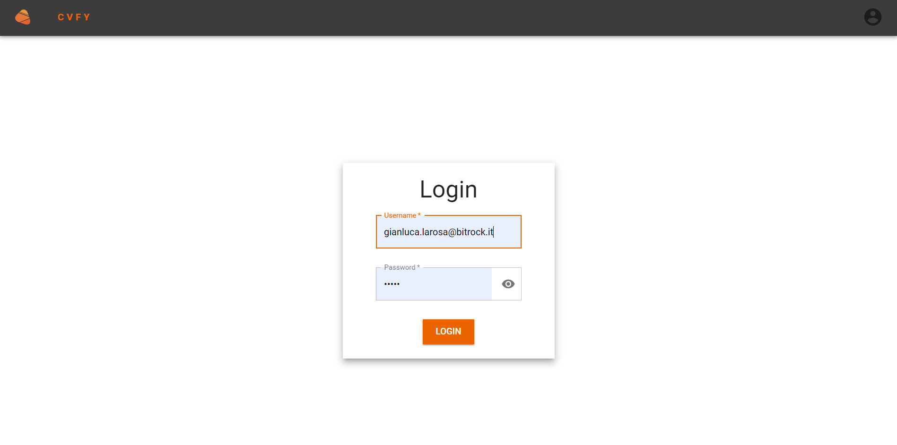

<div align="center">
  
</div>

# CVFY-Curriculum Manager

## Table of contents

- [General info](#general-info)
- [Screenshots](#screenshots)
- [Technologies](#technologies)
- [Organization](#organization)
  - [Folder structure](#folder-structure)
  - [Work Flow](#work-flow)
  - [Style Pattern](#style-pattern)
- [Components](#components)
- [Setup](#setup)
- [TODOs](#todos)

## General info

The curriculum manager you've ever wanted.

## Screenshots

<div align="center"> 
  
  
  
  
</div>

## Technologies


## Organization

### Folder structure

```
.
├── build                   # Compiled files (alternatively `dist`)
├── src                     # Source files (alternatively `lib` or `app`)
|   ├── assets
|   |  ├── icons
|   |  └── images
|   ├── components          # Reusable components
|   |  └── MUIOverride      # Custom components overriding Mui components
|   ├── config              # Configuration files
|   ├── context             # App context
|   ├── helpers             # Helper scripts
|   |  ├── hooks            # Reusable custom Hooks
|   |  └── services         # App services (tokenService.js, LocalStorageService.js, etc.)
|   ├── mocks               # Handlers to mock API
|   ├── pages               # All app views
|   ├── style
|   ├── App.jsx
|   └── index.js
├── .env                    # Enviroment data
└── README.md
```

### Work Flow

We are using git flow as our work flow.

### Style Pattern

### Branch pattern

Use this pattern to write branch name:

`[story id]-[story description]`

Each word must be separated by `-`.

Example:

- `20-fe-definizione-material`
- `5-fe-login-endpoint`
- `22-fe-creazione-navbar`

The branch must be written lowercase.

### Commit pattern

Use this pattern to write commit:

`[verb]: [completed tasks]`

Example:

- `add: login page`
- `fix: logout logic`
- `delete: function in login page`

The commit must be written lowercase.

### Regex pattern

Use this pattern when you declare a variable for regex:

`regex[type of regex]`

Example:

- `regexPassword`
- `regexDate`
- `regexAddress`

### Function's name pattern

We use the follow pattern for the function's name called in the event:

`handle+[function's name]`

Example:

- `handleDeleteSkills`
- `handleAccountDelete`

## Components

We use Mui Design system, [click here](https://mui.com/system/getting-started/overview/) for an overview.\
Some components are overridden, you can find them in `/src/components/MUIOverride/` folder.\
Instead of proper MUI components, you have to use overridden ones as a regular MUI components with some extra props as following:

- ### Box
  This component accepts as extra props `size` and `gutter`. \
  The first one valid values are one between: `sm`, `md`, `lg`, or `xl` (which is the default value).\
  The other one accepts an integer number, it will be multiplied by `theme.spacing()` and assigned as a margin all around the component.

```jsx
import Box from '@/src/components/MUIOverride/Box/Box';

<Box size="sm" gutter="1" sx={{ position: 'relative' }}>
  // child element
</Box>;
```

---

- ### Button
  The only extra prop added is `isLoading` and accepts a boolean value. \
  If true the button will be disabled and will appear a CircularProgress in the middle.

```jsx
import Box from '@/src/components/MUIOverride/Button/Button';

<Button isLoading={true || false}>// child element</Button>;
```

---

- ### Tooltip
  You can import the custom Tooltip by adding the proper tag as usual, then a dot and finally the chosen tooltip.\
  You can choose between `<Tooltip.Error>`,`<Tooltip.Warning>`, and`<Tooltip.Info>`.

```jsx
import Box from '@/src/components/MUIOverride/Tooltip/Tooltip';

<Tooltip.Error>// child element</Tooltip.Error>;
```

---

- ### Table
  Providing an object as a prop as shown in the below example, you can create a Table using our custom component.

```jsx
import Table from '@/src/components/MUIOverride/Table/Table';

const headers = [
  {
    id, // just an id - mandatory
    label, // the label will be shown in the header cell - mandatory 'renderCell' is null
    hidden, // a boolean stating if the relative column will be shown or not - default value false
    width, // colum's width - if not supplied the width will be based on the content
    align, // colum's alignment - default value "left"
    renderCell: (row) => (  // if provided, it will be shown instead of 'label' content
      <Typography component="a" href={row} target="_blank" rel="noreferrer">
        CV Candidato
      </Typography>
    ),
  },
  // ...
]

const tableProps = {
  striped, // a boolean sets the table rows style ad striped or not - true is default value
  headers, // an array containig headers info - mandatory
  data, // an array containing the rows of the table - if empty 'messageNoData' will be shown
  size, // a string choosen between "sm" or "md" that sets the table row heigth - "md" is default value
  hasPagination, // boolean that states if there is the pagination - false is default value
  children, // an element/array of elements that will be shown between the table body and table footer - optional
  isFetching, // boolean that disable all the table - false is default value
  hasHeader, // boolean that sets if the header will be shown - true is default value
  typeStriped, // string choosen between "even" or "odd", if 'striped = true' sets which are the styled rows
  messageNoData, // string that sets the message will be shown in case of empty table - default value "No data."
  maxHeight, // string stating the maximum height of the table in any valid measurement unit- default is "100%"
  rowsPage, // number of table rows shown per page - default 5
};

<Table {tableProps}>
  // child element
</Table>

```

---

We also provide a `CustomModal` component and to be able to work with it, you have to access the context and provide an object as following:

```jsx
import { useModal } from '../../context/modal';
const modalData = {
  isModalOpen: true,
  title: 'Delete', // modal's header title - optional
  content: <DeleteSkillModalContent data={skill} />, // a string or an element - optional
  disableClosing: true, // disallows closing modal by clicking on the backdrop - default false
  maxWidth: 'md', // maxWidth according to the actual Mui Modal component - default value "md"
  isPending: false, // when true set true disableClosing, disable and isLoading Button components - default false
  actionBtn: {
    // set the action Button with a label and a callback - optional
    label: 'DELETE',
    cb: async () => {
      await deleteSkillHandler(skill.id);
      modalClose();
    },
  },
  cancelBtn: {
    // set the cancel Button with a label and a callback - optional
    label: 'CANCEL',
    cb: () => {
      modalClose();
    },
  },
};

const {
  modalOpen, // supply the previous object as an argument to set and open the modal
  modalClose, // it will empty and close the modal
  setIsModalPending, // accepts a boolean as an argument
} = useModal();
```

## Setup

The project was bootstrapped with [Create React App](https://github.com/facebookincubator/create-react-app). \
To mantain the code clean we use [ESLint](https://eslint.org) with airbnb configuration and [Prettier](https://github.com/prettier/prettier).\
Create a `.env.development.local` file and paste in it the content of the `.env_sample` file in the root folder. Then substitute `xxx` with `http://localhost:3000`

In the project directory, you have to run:

## `npm install`

Install all needed dependencies.\
Then:

## `npm start`

Runs the app in the development mode.\
Open [http://localhost:3000](http://localhost:3000) to view it in your browser.

The page will reload when you make changes.\
You may also see any lint errors in the console.

## `npm run build`

Builds the app for production to the `build` folder.\
It correctly bundles React in production mode and optimizes the build for the best performance.

The build is minified and the filenames include the hashes.\
Your app is ready to be deployed!

## TODOs

- Add CV list filters
- Add a modify button for each skill
- Add a form to create/modify an account
- Add a form to create/modify a CV
- Dark theme
- Change favIcon
- Fix all `smthHandler` to `handleSmth`
